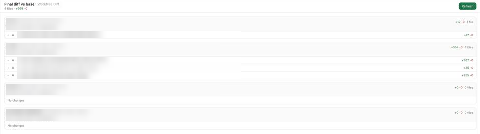

# paseo-nested-diff

[English](README.md) | 한국어

[Paseo](https://paseo.sh) 워크스페이스 패널입니다. **워크스페이스의 최종 diff를 한 화면에** 보여줍니다. 베이스 브랜치와의 merge-base를 현재 작업 트리와 비교하며, 워크스페이스 저장소뿐 아니라 **그 안에 중첩된 독립 저장소들**(서브모듈이 아닌 별도 clone이나 git worktree)까지 함께 보여줍니다.

브랜치에 커밋이 몇 개든 결과는 하나로 합쳐 보여주고, 커밋된 변경·커밋 안 된 변경·untracked 파일까지 모두 포함합니다.



## 기능

- 저장소별 섹션: 워크스페이스 저장소와 두 단계 깊이까지의 중첩 저장소. 각각 브랜치, 베이스 ref, merge-base sha, 전체 `+/-`와 파일 수를 표시합니다.
- 파일 목록에 상태(`A`, `M`, `D`, `R`, untracked는 `U?`)와 파일별 `+/-`를 보여줍니다. 파일을 누르면 추가/삭제가 색으로 구분된 unified diff가 펼쳐집니다.
- 중첩 저장소는 상위 저장소 diff에서 제외해서 같은 변경이 두 번 세어지지 않습니다.
- 새로고침 버튼이 있고, 좁은 화면(휴대폰)에서도 동작합니다.
- **읽기 전용**: `git rev-parse`, `merge-base`, `diff`, `ls-files`만 `GIT_OPTIONAL_LOCKS=0`로 실행하며 저장소에 아무것도 쓰지 않습니다.

## 베이스 브랜치 선택 방식

저장소마다 따로 정합니다. `origin/main`이 있으면 그것을, 없으면 `main`을 씁니다. diff 범위는 `git merge-base HEAD <base>` → 작업 트리입니다. 둘 다 없는 저장소는 diff 대신 오류 줄을 보여줍니다.

## 요구 사항

- Paseo 데몬과 앱 **0.10.2 이상**
- 데몬에서 플러그인 사용 설정 (Settings → Plugins)
- 데몬의 `PATH`에 `git`

## 설치

```bash
paseo plugin install github:hongmono/paseo-nested-diff
paseo plugin ls   # paseo-nested-diff가 "running"이면 정상
```

플러그인은 샌드박스 없이 실행되는 신뢰 코드이므로 설치 전에 소스를 확인하세요.

## 사용법

- **사이드바 (모바일·데스크톱)**: 앱 사이드바에서 **Nested Diff**를 열고 워크트리를 고릅니다. 프로젝트별로 묶여 있고, 변경이 있거나 최근 활동한 워크트리가 위에 옵니다. 휴대폰에서는 **‹ Worktrees**로 목록에 돌아가고, 넓은 창에서는 목록과 diff가 나란히 보입니다. **Wrap**을 켜면 긴 줄을 옆으로 스크롤하지 않고 줄바꿈해서 봅니다.
- **Explorer 탭 (데스크톱)**: 오른쪽 Explorer를 열고 Files·Changes 옆의 **Nested Diff** 탭을 고릅니다.
- **입력창 버튼 (데스크톱)**: 메시지 입력창 위의 **Diff**를 누르면 Explorer의 Nested Diff 탭이 열립니다.
- **단축키 (데스크톱)**: **⌘K**(Windows/Linux는 Ctrl+K)를 누르고 **Open Worktree Diff**를 선택합니다.

## 개발

```bash
npm install
npm run typecheck
npm test            # bun test/backend.ts: 임시 저장소를 만들어 합쳐진 diff를 검증
paseo plugin install "$PWD"
```

## 라이선스

MIT — [LICENSE](LICENSE) 참고. 중첩 저장소 감지 로직은 [phucth102/paseo-git-graph](https://github.com/phucth102/paseo-git-graph)(MIT)에서 가져와 수정했습니다.
